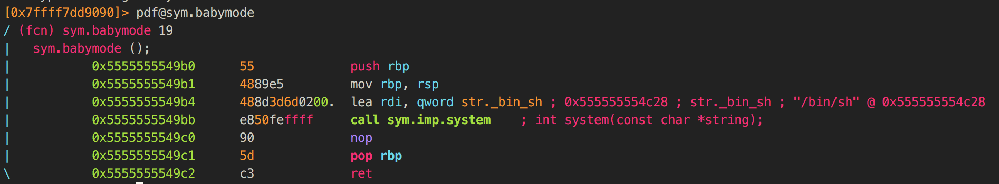
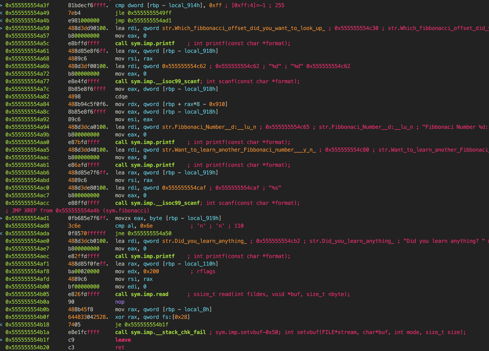

# Real Baby Pwnable

* **Category**: Pwn
* **Description**: _This is an actual baby pwn challenge._

This challenge has been the most educational for us, as it was the first time we could ever bypass stack canaries and ASLR through newfound techniques.

The complete script can be found [here](https://github.com/irvinlim/crossctf-2018-quals/blob/master/pwn/realbabypwn/pwn.py).

## Recon

Let's run the binary through [checksec](https://github.com/slimm609/checksec.sh), which tells us useful information before we even start reading our first line of assembly:

```sh
$ ~/bin/checksec --file realbabypwn
RELRO           STACK CANARY      NX            PIE             RPATH      RUNPATH      FORTIFY Fortified Fortifiable  FILE
Partial RELRO   Canary found      NX enabled    PIE enabled     No RPATH   No RUNPATH   Yes     0         4            realbabypwn
```

## Finding a way to get to shell

We see there's a hidden function `babymode` that brings us to our shell. This means that we can simply overflow the return address to get there:



## Finding injection points

We see that there's a very viable injection point in the 2nd input, since it has an unbounded `scanf("%s", ...)` without specifying the max length of the buffer:



However, we can't simply fill the buffer with junk to get to our return address, since there's a stack canary right before the return address, at address `0x7fffffffe3c8`.

## Information leak

Nevertheless, we are able to bypass the stack canaries through **information leakage**. Since the first `scanf` allows us arbitrary read from within the stack, we can leak the values of the canary at runtime, overflowing the buffer and _replacing the canary with its original value_, and replacing the return address after that.

We can find the relative position of the canary value from the start of the Fibonacci array through some trial and error, and we see that we can enter a value of 289 to return the decimal value of the first 8 bytes of the canary, and repeat for the next 8 bytes. This gives a payload in the following format:

```python
print '\x6e' * 2321 + canary1 + canary2 + new_return
```

We can try this payload on our local machine (with ASLR disabled) and see that it works!

## Defeating ASLR

The second hurdle for us was finding out that it did not work on the server, which was probably due to ASLR. Normally, we would just brute force ASLR as we had brute forced one in an hour before. However, we soon realised that 64-bit machines are pretty much impossible to brute force, due to the significantly larger address space as compared to a 32-bit one.

We were pretty much stuck at this stage until we realised we could simply leak the value of the _old_ return address from the stack, compute the relative position of that address `0x555555554b92` in the `.text` section from the address of `babymode`, which is `0x5555555549b0`, which gives us an offset of `-0x1e2`.

This should allow us to reliably jump to the correct function, since even though the addresses of ELF sections independently of each other, the addresses of stuff within each section does not change. What this means is that the relative position of the old return address from `babymode` will **always** be the same.

## Tweaking

The final hurdle was scratching our heads and not knowing why everything works locally but not on the server. Even with ASLR enabled locally, we are still getting segfaults when running the pwn on the server.

Going back to the drawing board, we see that the new return address could be `0x5555555549b4` instead of `0x5555555549b0`, since the first two instructions in the function are essentially useless for us:

```
[0x555555554ad1]> pdf@sym.babymode
/ (fcn) sym.babymode 19
|   sym.babymode ();
|           0x5555555549b0      55             push rbp
|           0x5555555549b1      4889e5         mov rbp, rsp
|           0x5555555549b4      488d3d6d0200.  lea rdi, qword str._bin_sh ; 0x555555554c28 ; str._bin_sh ; "/bin/sh" @ 0x555555554c28
|           0x5555555549bb      e850feffff     call sym.imp.system    ; int system(const char *string);
|           0x5555555549c0      90             nop
|           0x5555555549c1      5d             pop rbp
\           0x5555555549c2      c3             ret
```

The `push rbp` and `mov rbp, rsp` instructions are simply just to save the old value of `$rbp` onto the stack and update `$rbp` to the value of `$rsp` right as we enter the stack frame, which is a commonality we see in all x86-based assemblies. We can actually just jump straight to `0x5555555549b4` with no obvious difference.

However, we don't know why this is necessary on the server but not locally.

## Finally!

Finally we managed to do it (full script [here](https://github.com/irvinlim/crossctf-2018-quals/blob/master/pwn/realbabypwn/pwn.py)):

```sh
$ python pwn.py remote
[**] This is try #0...

[*] Calculated offset: 289
[*] Dumped canary part 1: 00a932d25fbcddc0
[*] Dumped canary part 2: 5018fa4dfe7f0000
[*] Original return address: 92dbb0556d550000
[*] New target address: b1d9b0556d550000
[*] Payload: 00a932d25fbcddc05018fa4dfe7f0000b1d9b0556d550000
[*] Calculate overflow size: 2321
[*] Sending payload...
[*] Switching to interactive mode...
id
uid=1000(realbabypwnuser) gid=1000(realbabypwnuser) groups=1000(realbabypwnuser)
find / -name flag 2> /dev/null
/home/realbabypwnuser/flag
cat /home/realbabypwnuser/flag
CrossCTF{It3r4t1ve_0ver_R3curs1v3}
```

Even though this was the easiest pwn challenge in the CTF but the only one we were able to complete (while taking such a long time nonetheless), we're not discouraged but instead extremely excited to have learnt new techniques to bypass various protection mechanisms!

## Tips

Some of the biggest takeaways we learnt from this challenge:

* [pwntools](https://docs.pwntools.com/en/stable/) is really, really great, and it's worthwhile to learn it inside out.
* It's possible to attach a running process to GDB while running a Python script, which we learnt from a handy tip by none other than [@nn_amon](https://www.reddit.com/r/securityCTF/comments/58w275/got_a_shell_with_pwntools_exits_almost_instantly/d94el6q/) himself:
  > I have another method of debugging an exploit if pwntools isn't opening another window/tmux panel properly.
  >
  > Just before triggering the overwrite, insert
  >
  > ```python
  > raw_input(str(r.proc.pid))
  > ```
  >
  > Then on a separate terminal,
  >
  > ```python
  > sudo gdb
  > attach <pid>
  > ```
* Documenting everything in your script is one of the best ways you can organise your thoughts and scratch work while doing pwns. It's far too easy to get your addresses confused by ASLR, endianness, etc. and you should make your life easier by being explicit in your script, especially if you're new.
